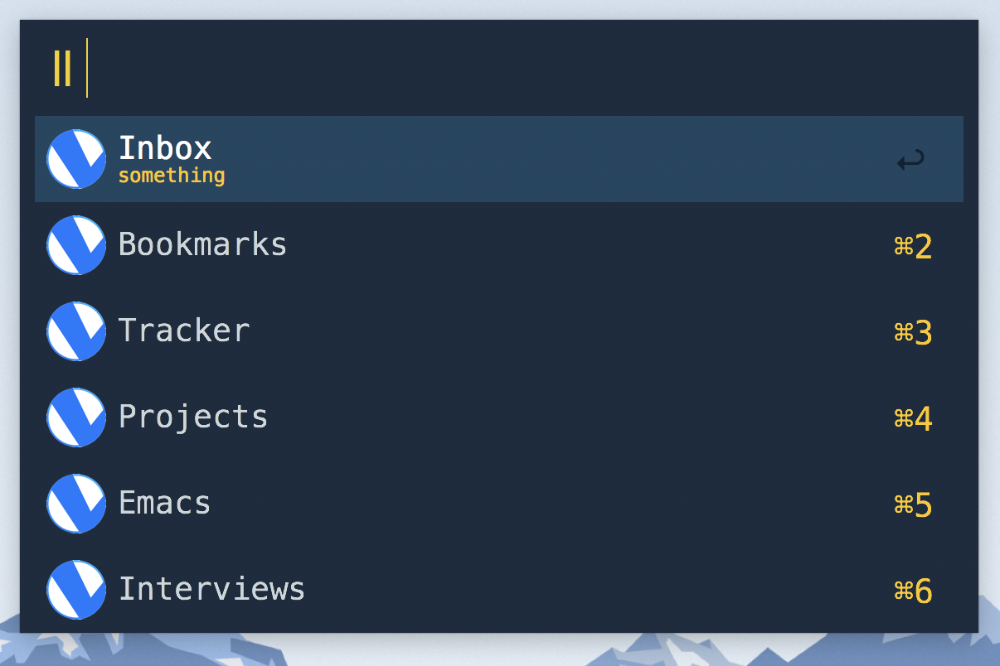

# Alfred Checkvist

[![license][license-badge]](./LICENSE)

Alfred workflow for quickly accessing your checklists in the Checkvist.

## Installation

- Download latest alfred-checkvist.alfredworkflow file from releases page
- Import your workflow by double-clicking on downloaded file
- Set variables `cv_login` and `cv_apikey` in the import page
- Click `Import` button

## Credentials

There are two variables you need to provide in order to use this workflow. They are `cv_login` which is the email you used for registering in Checkvist. Another one is `cv_apikey` which is API key for your profile. You can obtain API key on your [profile page](https://checkvist.com/auth/profile#status) in the "Open API key" section.

## Usage

- Invoke Alfred
- Type `ll`
- Select the checklist

## Development

This workflow is written using Rust language. If you want to build this workflow on your machine you'll need to install Rust first. The easiest way is to use [Rustup](https://rustup.rs/).

Once you have Rust installed, you can run `make` in your terminal. This command build the workflow, packs it and puts into `dist` folder.

## Contribution

All contributions are welcome.

If you found a bug or want to propose new feature, feel free to create an issue.

[license-badge]: https://img.shields.io/badge/license-MIT-blue.svg
